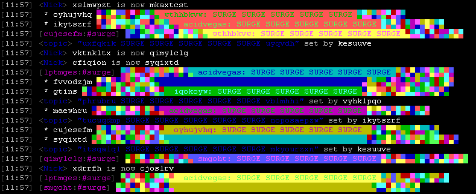

###### Requirements
* [Python](https://www.python.org/downloads/) *(**Note:** This script was developed to be used with the latest version of Python.)*
* [PySocks](https://pypi.python.org/pypi/PySocks) *(**Optional:** For using the `--proxy` setting.)*

###### Flood Attacks
- Action
- Color
- CTCP Channel / CTCP Nick *(PING, TIME, VERSION)*
- Cycle *(Join/Part)*
- Hilight
- Invite
- Message / Private Message
- Nick
- Notice
- Topic

The script uses IRC numeric detection and will stop a specific flood type if it becomes blocked.
If the channel becomes locked out due to a ban or specific mode, it will continue to flood the nicklist.

###### Screens
